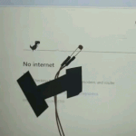

### Hi there 👋⚡⚡
#### Mechanical Engineer with a passion of coding.
<!--
**SumeetSingho123/SumeetSingho123** is a ✨ _special_ ✨ repository because its `README.md` (this file) appears on your GitHub profile.

Here are some ideas to get you started:

- 🔭 I’m currently working on my programming skills...
- 🌱 I’m currently learning everything related to front end ...
- 👯 I’m looking to collaborate on everyone on github. ...
- 🤔 I’m looking for help with ...
- 💬 Ask me about ...
- 📫 How to reach me: ...
- 😄 Pronouns: ...
- ⚡ Fun fact: ...
-->

🔭Currently working on android app🔭

🌱Technologies currently working with :🌱
* Frontend 
  * HTML5 
  * CSS3 
  * Javascript
* Backend
  * Python 
  * C++ 
  * Java
👯Looking to collaberate with everyone  
  [ ] Data Science
Nascent Stage but still getting through
Currently working on following projects
 * NPL
 * AI voice assistant.
 * AI home assistant.
 * AI in manfacturing. 
If any changes required please recommend with useful inputs.Thank you!
 

 

